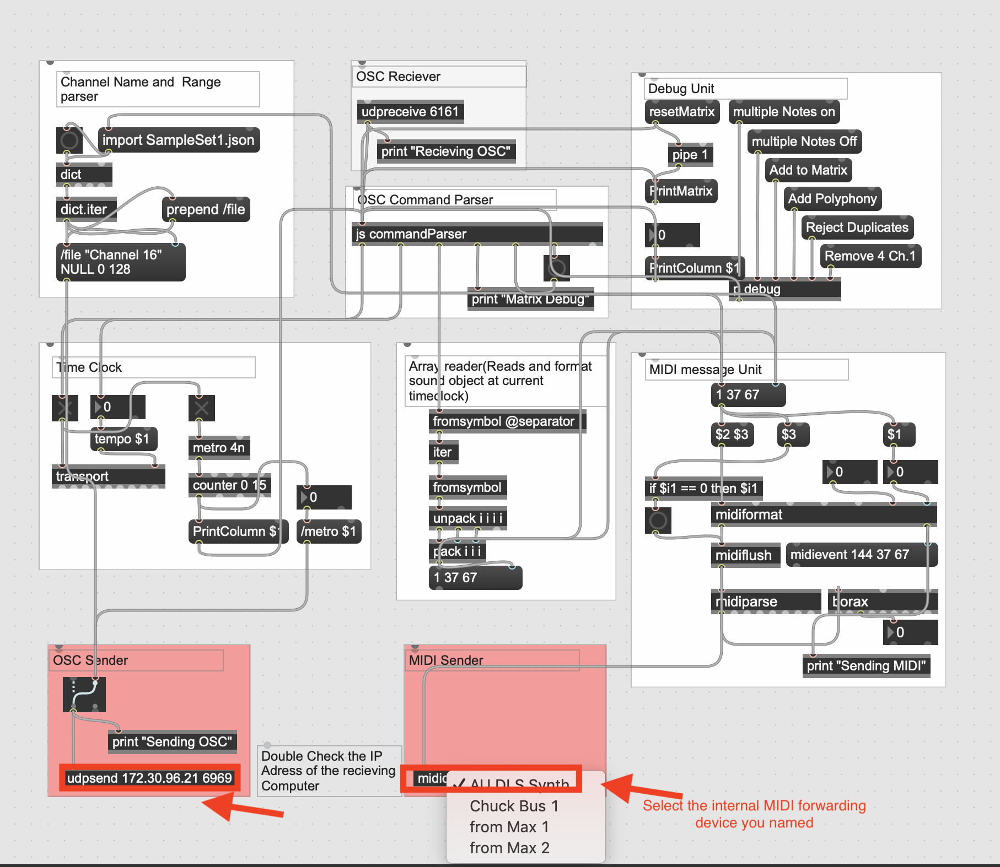
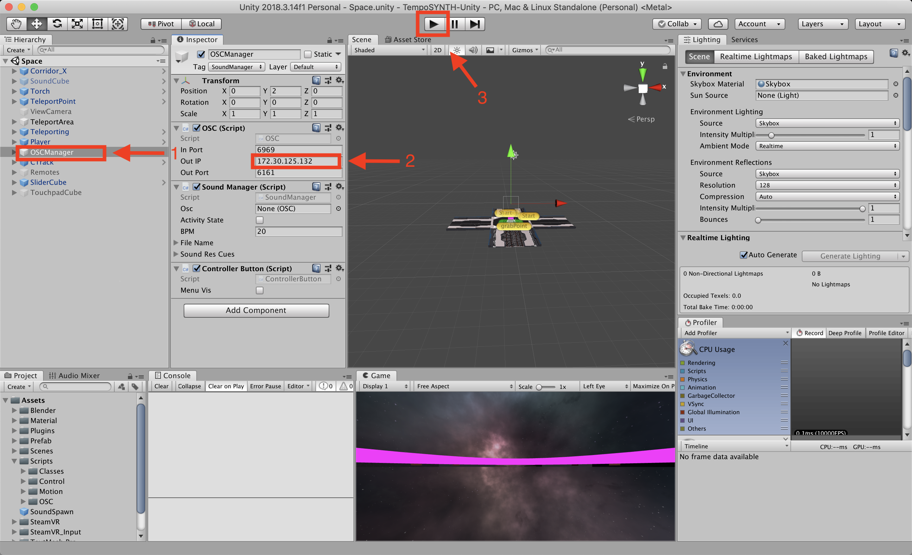

# tempoSYNTH

tempoSynth is an interactive VR Music Environment where users can utilize VR objects to make and play music.
This environment utilizes three softwares:

* Unity3D - VR environment
  * Sends and Recieces between MAX/MSP via OSC
* MAX/MSP - Audio backend
  * Sends and Recieces between Unity3D via OSC
  * Sends MIDI to Ablenton
* Ableton - Audio Player
  * Recieces MIDI from Max/MSP

## Installation / Prerequisites

Ideally, This project requires two computer to run at the same time for optimized experience. The following instruction is for two-computer set up.
(Though, it could be run on one computer by modifying IP address to local)

Install the following software

* Computer 1 - Unity3D (VR Interface)
* Computer 2 - MAX/MSP (Audio BackEnd)
* Computer 2 - Ableton (Audio Player)

Setup the following Hardware

* Computer 1 - VR head set that supports OPEN-VR standard.
* Computer 1 - VR enabled graphics card
* Computer 2 - Speakers
* General - Computer 1 and Computer 2 are connected to the same network, ethernet or Wi-Fi
  
Configure the following system settings

* Computer 1 & 2 - Disable Firewall
* Computer 2 - Set up internal MIDI forwading device(to bridge midi communication internally beween Max and Ableton)

## Run the environment

Computer 2:

* Open MaxMsp File from the follwoing directory
  
```bash
⁨tempoSYNTH⁩/⁨MAX⁩/⁨OSC-MIDI/OSCtoMIDI.maxpat
```

  * Modify "udpsend" IP address, to match Computer 1
  * Modify "midiout" device to the internal midi bridge deivice

* Open Ableton Project from the follwoing directory
  
```bash
⁨tempoSYNTH⁩/⁨MAX⁩/⁨OSC-MIDI/⁨SampleSet1 Project⁩/SampleSet1.als
```

* test if midi message communicates by using the debug unit in MAX/MSP

  

Computer 1:

* Open Unity3D and select the scene "Space.unity"
  1. Select "OSCManager" from the hierarchy
  2. Check the "OUT IP" address from inspector, make sure its maching the IP adress of Computer 2.
  3. Run the program in Unity to start


  
## Features

Unity:

* Sound Cube
  * Represent sound samples
  * Snaps to track when released
  * Pitch Control
  * Preview by hover
* Track
  * Quantize samples into matrix
  * Parse Matrix to Max via OSC
  * Adjustable in length
* Load samples chanel and range from JSON onstart
* Push Mechanism to create New Track
* Live Updated BPM Control slider
* Torch To Delete Tracks and Sound Cube
* Menu
  * Single Click - To toggle on/off Sound Menu
  * Hold - To turn On/Off metronome in Max

Max/MSP:

* OSC Communication
  * Message Parsing
  * Metronome
  * Global Tempo
  * JS Script
  * Channel names
  * Audio Preview
* MIDI Communication
  * Notes On
  * Notes Off
  * Audio Preview
  * Pitch Control

For additional OSC communication documentation, refer to OSC_Dod.MD

## Authors

* **Weiqi Yuan** - *Initial work* - [Portfolio](https://wiki0831.com)

* **Sang Won Lee** - *Advisor* - [Git](https://github.com/panavrin)